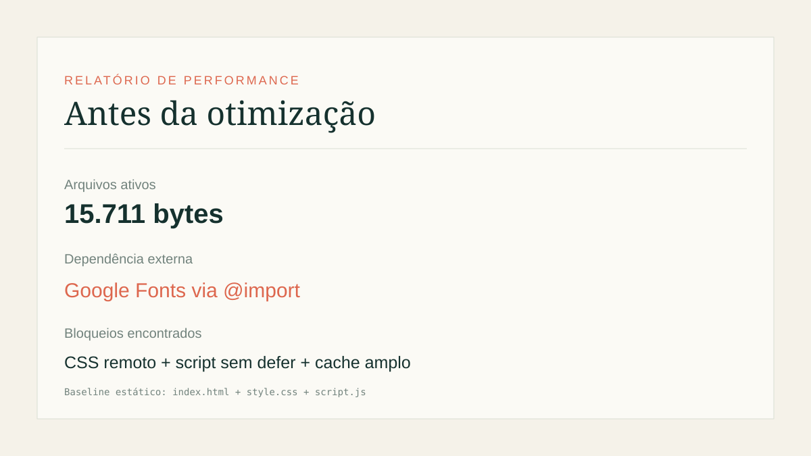
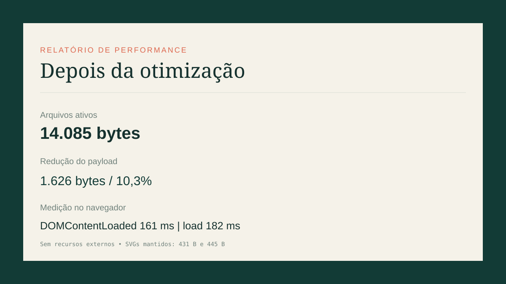

# Diário de Bordo

PWA offline-first para registrar atividades diárias. O projeto usa HTML, CSS e JavaScript sem dependências de runtime e salva as entradas no `localStorage`.

## Auditoria de performance

A análise foi feita em 21/09/2026 com a página aberta localmente no navegador. Os relatórios visuais estão em [relatorios/antes.svg](relatorios/antes.svg) e [relatorios/depois.svg](relatorios/depois.svg).

| Indicador | Antes | Depois | Variação |
| --- | ---: | ---: | ---: |
| Payload dos arquivos ativos | 15.711 B | 14.085 B | -1.626 B (-10,3%) |
| Recursos externos | Google Fonts | 0 | removido |
| Execução do JS | script bloqueante | `defer` | caminho crítico reduzido |
| DOMContentLoaded | não medido no baseline | 161 ms | medição final |
| Load event | não medido no baseline | 182 ms | medição final |

Os bytes representam `index.html`, CSS e JavaScript entregues pela aplicação em cada cenário. A medição temporal final foi feita com `performance.getEntriesByType('navigation')`, em carregamento local, sem cache prévio e sem dados no diário. Como o projeto não possui imagens raster, a conversão para WebP/AVIF e `loading="lazy"` não se aplicam: os únicos ícones já eram SVGs de 431 B e 445 B.

## Gargalos encontrados

- `@import` para três famílias do Google Fonts adicionava uma dependência de rede ao CSS crítico.
- O JavaScript era carregado sem `defer`.
- O service worker usava uma estratégia de cache ampla e podia interceptar origens externas.
- Não havia uma separação clara entre arquivos-fonte legíveis e assets de produção minificados.

## Melhorias aplicadas

- Removido o `@import` remoto e adotadas fontes locais de fallback, eliminando a requisição externa da primeira pintura.
- Criados [style.min.css](style.min.css) e [script.min.js](script.min.js), com CSS e JavaScript minificados usados pela página.
- Adicionado `defer` ao script de produção.
- Atualizado o cache do service worker para `v2`, incluindo somente os assets minificados e restringindo o `fetch` à mesma origem.
- Mantidos os ícones SVG, que já são menores que uma alternativa raster equivalente.
- O app já não renderiza imagens de conteúdo; por isso não foi aplicado lazy loading artificial em elementos que não existem.

## Como reproduzir

1. Abra `index.html` em um navegador ou sirva a pasta com um servidor estático.
2. Abra o Chrome DevTools e use Lighthouse em modo Mobile, sem throttling adicional além do preset escolhido.
3. Registre Performance, tamanho dos recursos e as oportunidades indicadas.
4. Compare com o estado atual, que usa `style.min.css` e `script.min.js`.

Para uma comparação Lighthouse formal, exporte os relatórios JSON/PDF no mesmo dispositivo, viewport e condições de rede. Os relatórios incluídos neste exercício são imagens SVG com as medições locais reproduzíveis acima; não apresentam uma pontuação Lighthouse inventada.

## Estrutura

- `index.html`: estrutura e acessibilidade da interface.
- `style.css` e `script.js`: fontes legíveis para manutenção.
- `style.min.css` e `script.min.js`: assets usados em produção.
- `service-worker.js`: cache offline same-origin.
- `icons/`: ícones SVG do PWA.
- `relatorios/`: evidências visuais antes/depois.
